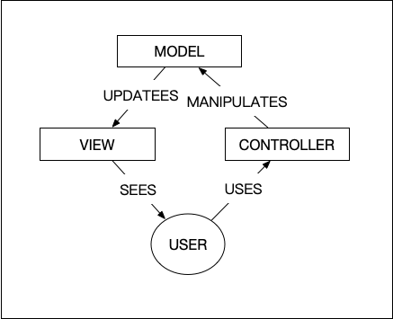
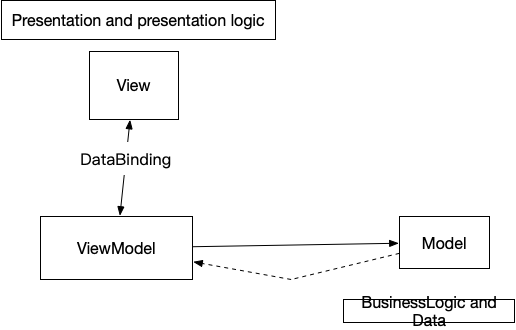
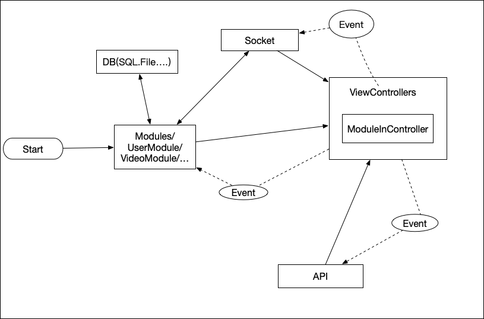
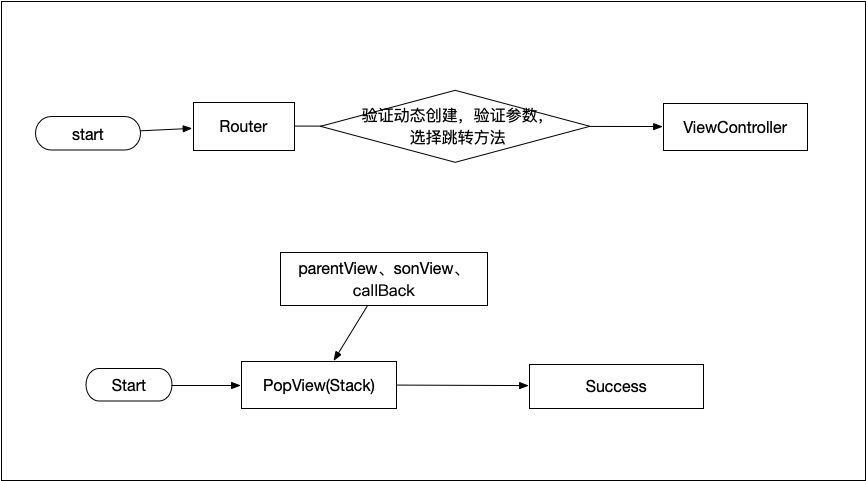

## 我理解的设计模式
* 设计模式有什么用
    1. 设计模式，是开发先辈们，在开发中长期积累的经验，给我们留下的宝贵财富。
    2. 设计模式可以让我们站在巨人的肩膀上，思考。
* MVC
    
* M V VM
    
* 设计模式的使用？
    1. 每个设计模式，都有自己，本来的使用场景，切记不可以完全套用
    2. 每个设计模式，都需要在根据业务，做出少许的变动
* 目前流向的框架有哪些
   1. MVC、M V VM、MVP 的区别是什么？
   2. MVC、M V VM、MVP 和我们理解的他们有什么不同？
* 我常用的设计模式
    1. MVC / M V VM / MVP / 工厂模式 / 组合模式。

* 框架 是为了解决什么问题的？ （我不会问什么是 “框架”）
  1. 框架是为了让整个项目，可以按照已经约定好的规则，让程序员写出统一的代码。
  2. 统一数据流的方向 和 事件分发。
  3. 高内聚 低耦合 的原则，使 项目周期中 业务之间可以 更容易的解耦 和 重构。
  

* 殊途同归，所有框架都是为了，数据流 的清晰，使开发者有一个基本的开发思路，团队中可以根据框架的思路，编写出统一数据流的，代码机构。
  
***
# 我的工程原则
    1. 低耦合 高内聚 弱耦合。
    2. 不同的人开发的内容之间，弱耦合。
    3. 不同的业务之间，弱耦合。
    4. 切记过度开发，过度思考。
    5. 能用简单方法实现的方法，坚决不适用复杂的实现方式。
    6. 项目发生，业务耦合或者内码耦合，及时找时间重构。
    7. 他人维护代码，尽量可以快速的找到，代码的逻辑。（UI 颗粒化,code 颗粒化）

## 我的项目开发框架模型图。

## 我的框架组件，和项目框架，没有耦合
  

* 项目开发模式是要根据业务需求不断演化 重构出来。
* 没有完美的开发框架和开发模式。
***
## 对于 看项目奖代码 目前想要得到 “回答” 和 “疑惑”
    1. 部分 的 protperty 和 function 没有 private 标志。
    2. 系统默认的 internal 是否需要添加
    3. 如果不需要添加，我们看别人的代码如何才能很快的找到 外部可以调用的代码
    4. 对于生命周期 的 方法放在 category 中怎么看